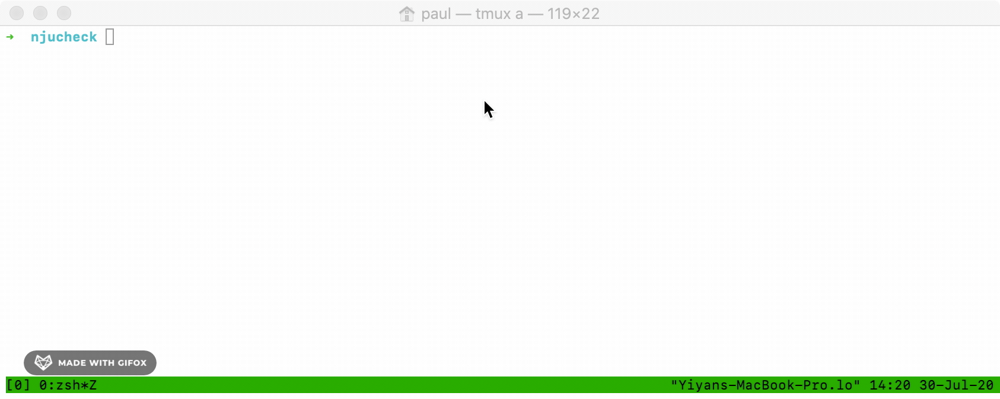

# njucheck




**njucheck** is a MacOS utility that checks NJ Unemployment claims in the command line. It is written because tens of thousands of people have been waiting months for their unemployment money, and check this tedious form everyday.

This script opens the form, fills everything in and then clicks the check button. 

It then waits for the result by checking the presence of a hardcoded div and gets its text value.

```python
result = WebDriverWait(driver, 10).until(EC.presence_of_element_located((
    By.XPATH, '//*[@id="f1"]/div[2]/div/div/div/div[3]/div[1]/font'))).text
```

This result will contain a string that says `Pending`, or if you're lucky, something else :).

## Usage
This script requires MacOS and python3. It also requires the python3 module `selenium` to be installed.

Run this:

`pip3 install selenium`

This script requires Google Chrome Canary `Version 86.0.4217.2 (Official Build) canary (x86_64)`. Download and install it [from here](https://www.google.com/chrome/canary/) and give it permission to run in the `Security and Privacy` MacOS settings window.

This script requires the following environment variables to be set with your information:

* `SSN`
* `DOB` : In the format of MM/DD/YYYY
* `EMAIL`
* `FIRSTNAME` : all lowercase
* `LASTNAME` : all lowercase

Use the following commands to export your info:
```bash
export SSN="123456789"
export DOB="01011980"
export EMAIL="johndoe@gmail.com"
export FIRSTNAME="john"
export LASTNAME="doe"
```

Then simply run this command in the **njucheck** folder:
```
./njucheck.py
```

## Selenium

This program uses Selenium to automate the web interaction.

It uses Chrome Canary in a headless mode, as described [in this
article](https://duo.com/decipher/driving-headless-chrome-with-python).

This package contains the latest Chrome Canary selenium driver as of July 2020 (793302) that
works with Google Chrome Canary 86.0.4217.2. If you are having driver version
issues, you can try downloading the selenium driver that matches with your
Chrome version. The only file you need in the directory of this script is the
executable `chromedriver`.

Downloading the Chrome Canary selenium driver is a bit of a pain. Use the
[driver website](https://chromedriver.chromium.org/chromedriver-canary) and
follow the instructions to locate the latest build and then download the
driver. Then move the driver to the project.
